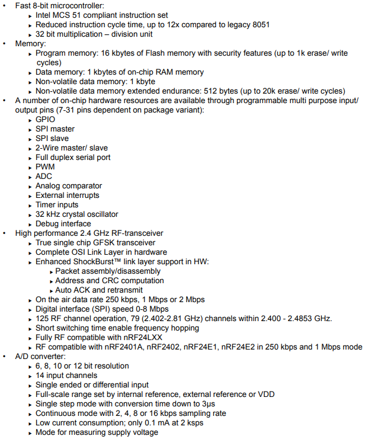

# [nRF24LE1](https://github.com/SoCXin/nRF24LE1) 

 

#### [Vendor](https://github.com/SoCXin/Vendor) ：[Nordic](https://github.com/SoCXin/Nordic) 
#### [Core](https://github.com/SoCXin/8051) ：[E8051](https://github.com/SoCXin/8051) 
#### [Level](https://github.com/SoCXin/Level) ：16MHz

### [nRF24LE1简介](https://github.com/SoCXin/nRF24LE1/wiki)

[nRF24LE1](https://github.com/SoCXin/nRF24LE1) 是 [Nordic](https://www.nordicsemi.com/) 集成增强型8051单片机和2.4Ghz低功耗无线收发内核nRF24L01P，是市面上少有的单芯片2.4G射频SoC

 

### [资源收录](https://github.com/SoCXin)

* [文档](docs/)
* [资源](src/)

### [关联资源](https://github.com/SoCXin)

* [keil开发](http://www.keil.com/dd/chip/4727.htm) 

支持JTAG调试器

### [替换方案](https://github.com/SoCXin)

[nRF24LE1](https://github.com/SoCXin/nRF24LE1) 

###  [SoC芯平台](http://SoC.Xin) 
